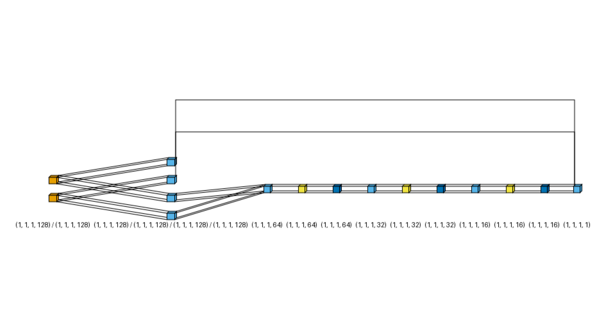

# 🎬 CineMatch — A Neural Movie Recommendation System

[](https://www.python.org/)
[](https://pytorch.org/)
[](https://streamlit.io/)
[](LICENSE)
[](https://grouplens.org/datasets/movielens/)

> A full-stack recommender system that combines **Neural Collaborative Filtering (NCF)** for personalized user recommendations and **Content-Based Filtering** for item-to-item similarity — wrapped in an interactive Streamlit dashboard.

---

## 📋 Table of Contents

- [Overview](#-overview)
- [Project Structure](#-project-structure)
- [System Architecture](#-system-architecture)
- [Results](#-results)
- [Getting Started](#-getting-started)
- [Running the Dashboard](#-running-the-dashboard)
- [Important Note](#%EF%B8%8F-important-note)
- [Contributors](#-contributors)

---

## 🧠 Overview

CineMatch is built on the **MovieLens (small)** dataset — 100,836 ratings across 9,742 movies by 610 users — and consists of two recommendation engines:

| Component | Approach | Used In |
|---|---|---|
| **User Recommender** | Neural Matrix Factorization (NeuMF): MF branch (dot-product embeddings) + MLP branch (non-linear interactions) | User Page |
| **Item Similarity** | TF-IDF vectorization on genres & user tags → Cosine Similarity | Item Page |

---

## 📂 Project Structure

```
A-Neural-Movie-Recommendation-System/
│
├── explore.ipynb                     # Phase 1 — Data loading, EDA, preprocessing & train/val/test split
├── training NCF.ipynb                # Phase 2 — NCF model training, evaluation & inference export
├── Item_Similarity.ipynb             # Phase 3 — TF-IDF + Cosine Similarity, saves similarity matrix
├── tests.py                          # Operational tests for the trained model
├── model_archi.png                   # NCF architecture diagram (referenced in Phase 2 notebook)
├── requirements.txt                  # Python dependencies
│
├── data/                             # Raw MovieLens CSV files (not tracked by Git)
│   ├── ratings.csv
│   ├── movies.csv
│   ├── tags.csv
│   ├── links.csv
│   └── README.txt
│
├── processed/                        # Generated by explore.ipynb (Phase 1)
│   ├── mappings.pkl                  # User & movie ID ↔ model index mappings
│   ├── movies_full.csv               # Enriched movie metadata (genres, tags, year, links)
│   ├── ratings_encoded.csv           # All ratings with encoded user/movie indices
│   ├── train.csv                     # Training split (80%)
│   ├── val.csv                       # Validation split (10%)
│   └── test.csv                      # Test split (10%)
│
├── models/                           # Generated by Phase 2 & Phase 3 notebooks
│   ├── ncf_model.pt                  # Final trained NCF model weights
│   ├── ncf_best_checkpoint.pt        # Best checkpoint (lowest validation loss)
│   ├── ncf_config.pkl                # Architecture config + test metrics
│   ├── cosine_sim_matrix.npz         # ⚠️ Precomputed movie-movie similarity matrix (large file)
│   ├── tfidf_vectorizer.pkl          # Fitted TF-IDF vectorizer
│   └── item_similarity_mappings.pkl  # movieId ↔ matrix row index mappings
│
└── dashboard/
    ├── app.py                        # Streamlit entry point & landing page
    ├── utils.py                      # Shared model/data loading & inference helpers
    └── pages/
        ├── 1_User_Page.py            # Personalized Top-N recommendations (NCF)
        └── 2_Item_Page.py            # Item profile & similar movies (Cosine Similarity)
```

---

## 🏗 System Architecture

### NCF Model



The model combines two branches:

- **MF Branch** — element-wise product of user and item embeddings (linear interactions, like classic Matrix Factorization)
- **MLP Branch** — concatenated embeddings passed through fully connected layers with ReLU + Dropout (non-linear interactions)
- **Output Layer** — combines both branches into a single predicted rating

### Item Similarity Pipeline

```
Movie genres + user tags
        ↓
  TF-IDF Vectorizer
        ↓
  Cosine Similarity Matrix (9,742 × 9,742)
        ↓
  Top-N similar movies for any selected item
```

---

## 📊 Results

Evaluated on the held-out test set (10% of ratings, split per user):

| Metric | Score |
|--------|-------|
| **RMSE** | 0.8543 |
| **MAE** | 0.6587 |

---

## 🚀 Getting Started

### 1. Clone the repository
```bash
git clone https://github.com/mohammedrefai20/A-Neural-Movie-Recommendation-System.git
cd A-Neural-Movie-Recommendation-System
```

### 2. Install dependencies
```bash
pip install -r requirements.txt
```

### 3. Add the dataset
Download [MovieLens (small)](https://grouplens.org/datasets/movielens/latest/) and place the following files inside the `data/` folder:
```
data/
├── ratings.csv
├── movies.csv
├── tags.csv
└── links.csv
```

### 4. Run the notebooks in order

| Step | Notebook | Output |
|------|----------|--------|
| Phase 1 | `explore.ipynb` | `processed/` folder |
| Phase 2 | `training NCF.ipynb` | `models/ncf_model.pt`, `models/ncf_config.pkl` |
| Phase 3 | `Item_Similarity.ipynb` | `models/cosine_sim_matrix.npz`, `models/tfidf_vectorizer.pkl`, `models/item_similarity_mappings.pkl` |

---

## 🖥 Running the Dashboard

```bash
streamlit run dashboard/app.py
```

The dashboard has two pages, auto-detected by Streamlit from the `pages/` folder:

**👤 User Page**
- Select any user from the dataset
- View their full rating history
- Set N (items per page) and generate personalized Top-N recommendations powered by the NCF model
- Navigate results with Previous / Next / Jump-to-page controls

**🎬 Item Page**
- Search and select any movie from the catalog
- View its full profile (genres, tags, rating stats, IMDb & TMDB links)
- Discover the Top-N most similar movies using Cosine Similarity
- Navigate results with Previous / Next / Jump-to-page controls

---

## ⚠️ Important Note

The precomputed similarity matrix (`models/cosine_sim_matrix.npz`) is a large file and is **not tracked by Git**.

Before running the dashboard's **Item Page**, you must generate it locally by running `Item_Similarity.ipynb` first. Without this file the Item Page will not load.

```
Item_Similarity.ipynb  →  models/cosine_sim_matrix.npz  →  streamlit run dashboard/app.py
```

---

## 👥 Contributors

<table>
  <tr>
    <td align="center">
      <a href="https://github.com/sabry558">
        <b>Ahmed Sabry</b>
      </a>
    </td>
    <td align="center">
      <a href="https://github.com/MahmoudSayed216">
        <b>Mahmoud Sayed</b>
      </a>
    </td>
    <td align="center">
      <a href="https://github.com/mohammedrefai20">
        <b>Mohammed Refai</b>
      </a>
    </td>
    <td align="center">
      <a href="https://github.com/Youssef-Hossam5">
        <b>Youssef Hossam</b>
      </a>
    </td>
    <td align="center">
      <a href="https://github.com/mohamedmagdy9977">
        <b>Mohammed Magdy</b>
      </a>
    </td>
  </tr>
</table>

---

> Dataset provided by [GroupLens Research](https://grouplens.org/datasets/movielens/), University of Minnesota.
> F. Maxwell Harper and Joseph A. Konstan. 2015. The MovieLens Datasets: History and Context. ACM Transactions on Interactive Intelligent Systems (TiiS) 5, 4: 19:1–19:19.